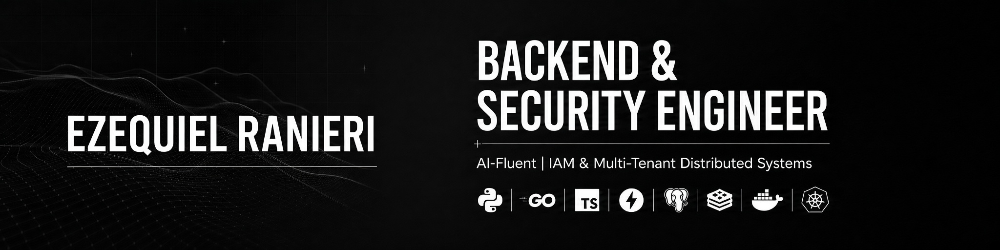

 

---

I build secure, scalable, production-grade backend systems — combining strong architectural thinking with modern AI-assisted workflows to deliver high-quality solutions with speed and precision. My focus: Identity & Access Management, distributed systems, and security engineering — currently deepening my expertise in **Go** for high-performance services.

Self-taught backend engineer from Salto Grande, Santa Fe. I started by helping friends with concrete problems and, over time, focused on what interests me most: security, backend systems, and clean architecture. I learned on my own — researching, building, and documenting every decision. Today I combine backend with artificial intelligence, always prioritizing secure, scalable, and maintainable systems. I'm motivated by understanding how systems work inside and building tools that genuinely solve problems.

 

## Selected Work

| Project | Description | Stack |
|---|---|---|
| [**hex-auth-service**](https://github.com/ezequielranieri/hex-auth-service) | High-performance hexagonal IAM — O(1) token validation, real-time security breach detection, refresh token rotation (FastAPI, PostgreSQL, Redis) |     |
| [**flowcore**](https://github.com/ezequielranieri/flowcore) | Distributed, durable, and observable workflow engine |    |
| [**go-durable-jobs**](https://github.com/ezequielranieri/go-durable-jobs) | Durable job processor in Go — Postgres queue, idempotency, retries with backoff, graceful shutdown |   |
| [**go-authz**](https://github.com/ezequielranieri/go-authz) | Internal multi-tenant authentication and authorization service — Clean Architecture |   |
| [**agro-iam**](https://github.com/ezequielranieri/agro-iam) | Multi-tenant farm management platform in Go — FORCED Row Level Security, refresh token rotation with family-based reuse detection, tamper-evident audit hash chain |    |
| [**agro-agent**](https://github.com/ezequielranieri/agro-agent) | Multi-tenant AI backend for agricultural cooperatives — tool-calling agent with deterministic domain routing, human-in-the-loop approvals, RAG over documents (pgvector) |    |

[**Explore all repositories →**](https://github.com/ezequielranieri?tab=repositories)

 

## Tech Stack

 

## Certifications

| | |
|---|---|
|  | **Secure AI/ML Driven Software Development** LFEL1012 — [Verify](https://www.credly.com/badges/5a40b7c0-c673-4cb9-8845-1b2b9212eac3/public_url) |
|  | **Developing Secure Software** LFD121 — [Verify](https://www.credly.com/badges/6cfd4b7b-97a2-41ba-a9aa-dae369f89453/public_url) |

 

## Engineering Principles

| | |
|---|---|
| **01** | Architecture is a deliberate decision — hexagonal / clean boundaries between domain logic and infrastructure |
| **02** | Security is a design constraint from day one, not a layer added at the end |
| **03** | Systems are built to fail safely — idempotency, retries, dead-letter queues, observability |
| **04** | Documentation and honest retrospectives are part of the deliverable, not an afterthought |

 

## Activity

 

**Let's build together.** &nbsp;→&nbsp; [ez.ranieri@gmail.com](mailto:ez.ranieri@gmail.com)

Salto Grande, Santa Fe, Argentina

